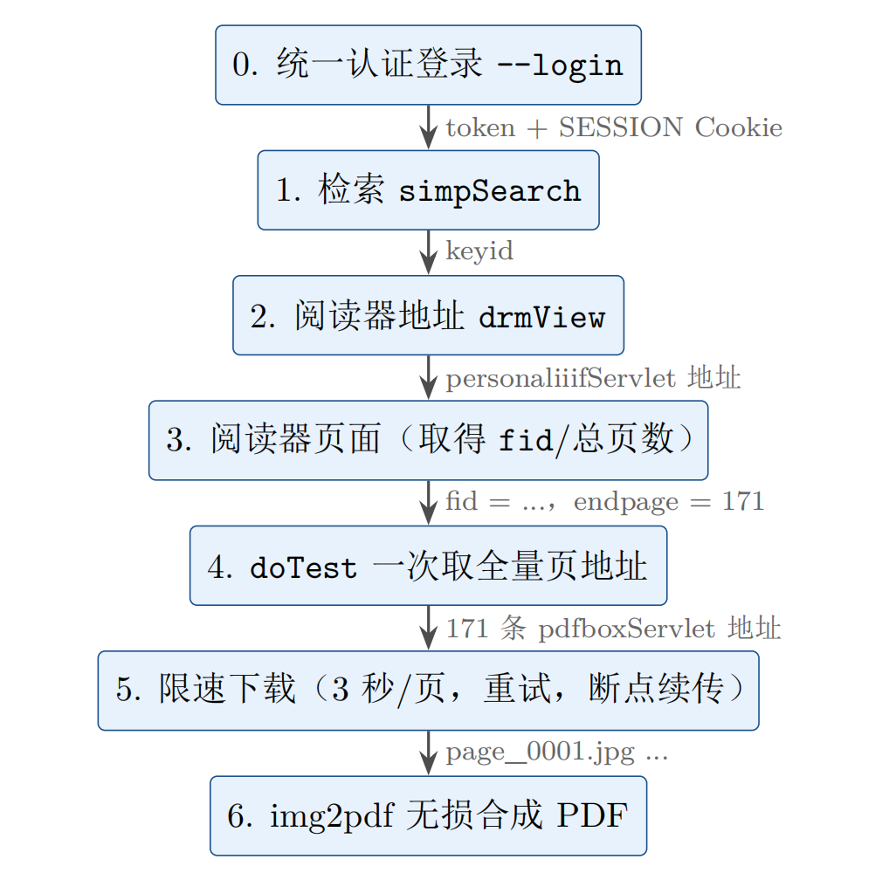

# fudan-thesis-scraper

越开网站 JSON 限制，从复旦大学学位论文库（<https://thesis.fudan.edu.cn/>）抓取无水印的单篇学位论文的在线阅览页面图片，并合成 PDF。

**⚠️ 网站仅提供在线阅览，不支持下载。下载内容仅供个人学习，请勿传播，尊重版权！**

**⚠️ 网站仅提供在线阅览，不支持下载。下载内容仅供个人学习，请勿传播，尊重版权！**

**⚠️ 网站仅提供在线阅览，不支持下载。下载内容仅供个人学习，请勿传播，尊重版权！**

本工具复现浏览器在线阅览时的请求，默认 3 秒/页 限速。可用于去水印便于阅读和修正部分横版页面导致的图片失真。

## 工作原理



**抓取管线。步骤 0 只需执行一次，登录态缓存于 ~/.fudan-thesis-scraper/token.json **


| 步骤 | 请求 | 说明 |
|---|---|---|
| 1. 关键词检索 | `POST /md/papersearch/simpSearch` | 匿名可用 |
| 2. 换 token | CAS 统一认证 → `POST /md/account/caslogin` | 见「登录」 |
| 3. 阅读器地址 | `GET /md/docobject/drmView?keyid=...&isappend=0&onlineflag=online` | 需要 token + 登录 Cookie |
| 4. 阅读器页面 | `GET drm.fudan.edu.cn/read/personaliiifServlet?path=...` | 含 fid/页数等隐藏域 |
| 5. 全量页地址 | `POST /read/doTest?fid=...&startpage=1&endpage=N` | 一次返回全部页地址 |
| 6. 逐页图片 | `GET /read/pdfboxServlet?pdfname=...&page=<加密串>&scale=3f` | 无需 cookie |

地址末尾 `&watermark=<姓名 学号 日期>` 参数会被浏览器 canvas 以水印的形式叠加在图片上，`pdfboxServlet` 直出的就是干净页面图。

站点把 token 与登录会话的 `SESSION` Cookie **绑定校验**，所以登录态缓存里两者成对保存（`~/.fudan-thesis-scraper/token.json`），抓取时一并恢复。

## 安装依赖

```bash
py -m pip install -r requirements.txt
```

## 登录（统一认证，推荐）

学校配置为仅统一认证（`loginType=2`），站点的普通账号密码登录不可用。
脚本采用"浏览器辅助登录"：

```bash
py main.py --login
```

1. 脚本在本机随机端口起一个一次性回调服务器，并打开浏览器进入复旦统一认证；
2. 你在官网页面正常登录（账号/密码/验证码/2FA 都由官网处理，**脚本接触不到密码**）；
3. 认证通过后 CAS 按回调地址跳回本机，脚本拿到 `learnid/vcode` 等参数，调 `account/caslogin` 换取 token，连同会话 Cookie 一起缓存到本地；
4. token 有效期约 10 小时（JWT），过期后重跑 `--login` 。

## 登录（Cookies，适合对脚本有密码泄露顾虑的人）

先在浏览器中完成网站登录，按终端提示把登录完成后浏览器地址栏的完整 URL 粘贴进来，或直接粘贴 F12 → Local Storage 里的 `token` 值；也可以随时用 `--token <值>` 手动指定（注意：纯 token 缺 Cookie 会被判失效，建议优先 `--login`）。

## 用法

```bash
# 按标题检索并下载（标题自动精确匹配；多条结果时用 --index N 选择）
py main.py --title "教育对中国居民肥胖的影响研究"

# 先看看检索结果
py main.py --title "肥胖" --search-only

# 已经拿到检索结果 keyid 时
py main.py --keyid "nnNSj3kaQq%2BBnb3wDWOHDM2QQQ8qfPMN9KRUVv96ebk%3D"

# 已经有在线阅读器地址时
py main.py --reader-url "https://drm.fudan.edu.cn/read/pdfindex?..."

# 不想登录：浏览器里打开在线阅读页，Ctrl+S 保存为 HTML，直接解析本地文件
py main.py --from-html "复旦大学学位论文.html"

# 试跑前 3 页
py main.py --title "..." --max-pages 3

# 只下载图片不合成 PDF；自定义输出目录与间隔
py main.py --title "..." --no-pdf --out D:/theses --delay 3
```

## 输出

```
output/
├── 论文标题.pdf            ← 最终 PDF
└── 论文标题/
    └── images/
        ├── page_0001.jpg   ← 每页原图（断点续传：重跑自动跳过已下载页）
        ├── page_0002.jpg
        └── ...
```

## 代码结构

```
fudan_scraper/
├── config.py       站点地址、浏览器伪装头、限速参数、分辨率与水印开关、检索模板
├── client.py       会话封装：检索、站点配置、caslogin 换 token、drmView、
│                   阅读页解析（静态正则 / 动态 doTest）得到全量页地址
├── auth.py         统一认证登录：本地回调服务器接 CAS 跳转，token+Cookie 成对缓存
├── parser.py       静态页图片地址提取、阅读器隐藏域解析、URL 规格化（scale/水印）
├── downloader.py   限速下载：3 秒/页、失败重试、断点续传
└── pdf_builder.py  img2pdf 无损合成 PDF（缺依赖时退回 Pillow）
main.py             命令行入口
```

## 已知限制

- token 有效期约 10 小时且与会话 Cookie 绑定，过期重跑 `py main.py --login`（SSO 存活时自动完成）。
- 阅读会话（fid）绑定打开阅读页时的 Cookie，工具内部始终用同一会话，跨进程复用登录态即可。
- 若非着急使用，请不要调低下载间隔（默认 3 秒/页）；下载内容仅供个人学习，请勿传播。

